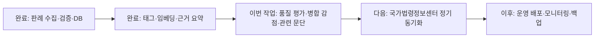

# 통매음 검색 품질 개선 Implementation Plan

> **For agentic workers:** REQUIRED SUB-SKILL: Use superpowers:subagent-driven-development (recommended) or superpowers:executing-plans to implement this plan task-by-task. Steps use checkbox (`- [ ]`) syntax for tracking.

**Goal:** 통매음 중심 판례를 우선하고 병합 사건의 다른 범죄 내용이 검색 태그·요약에 섞이는 문제를 줄이며, 55점 미만 결과를 표시하지 않는다.

**Architecture:** 로컬 DB를 사용하는 24개 고정 평가 세트로 변경 전후를 비교한다. `precedent-scope.mjs`가 사건명 중심도와 통매음 관련 문단을 결정하고, 검색은 고정 키워드 상한·45/45/10 가중치·중심도 감점·55점 최저선을 순서대로 적용한다. 태그와 요약은 관련 문단만 사용하고 각각 `rule-v2`, `grounded-v2`로 무효화한다.

**Tech Stack:** Node.js ESM, PostgreSQL/pg, Node test runner, OpenAI Responses API, React 19

## Global Constraints

- 판례 결과, 고소 가능성, 형량을 예측하지 않는다.
- 사용자 사례를 AI 요약 모델에 전송하지 않는다.
- 사건번호·법원·선고일·공식 URL은 검증 DB에서만 읽는다.
- 검색 점수 55점 미만은 빈 결과로 처리한다.
- `mixed`는 15점, `peripheral`은 30점을 감점한다.
- 키워드 점수는 `ts_rank_cd / 0.5`를 0~100으로 상한 처리한다.
- 관련 문단이 3개 미만이면 전체 원문으로 폴백하지 않는다.
- 실제 `grounded-v2` 요약 재생성은 공개 판결문 외부 전송과 API 비용이 발생하므로 실행 직전에 다시 사용자 확인을 받는다.
- 사용자 소유 `prototype/design-qa 2.md`를 변경하지 않는다.

---

### Task 1: 24개 검색 품질 평가 세트와 베이스라인

**Files:**
- Create: `prototype/tests/fixtures/search-quality-cases.mjs`
- Create: `prototype/server/search-quality-evaluator.mjs`
- Create: `prototype/tests/search-quality-evaluator.test.mjs`
- Create: `prototype/scripts/evaluate-search-quality.mjs`
- Modify: `prototype/package.json`

**Interfaces:**
- Consumes: `searchPrecedents({pool, query, limit:3, embeddingClient:null})`
- Produces: `evaluateSearchQuality({cases, search}) -> {caseCount, top1Accuracy, top3Recall, forbiddenExposureRate, emptyAccuracy, failures}`

- [x] **Step 1: 24개 고정 평가 사례를 작성한다.**

`SEARCH_QUALITY_CASES`는 아래 그룹을 정확히 포함한다.

```js
const GAME_CASES = [
  "게임 채팅으로 처음 만난 상대가 제 부모를 성적으로 비하하는 욕설을 한 번 보냈습니다.",
  "온라인 게임 같은 팀 사람이 귓속말로 어머니에 대한 성적 패드립을 보냈습니다.",
  "게임에서 다툰 뒤 상대가 메일과 채팅으로 성적인 비하 문구를 반복했습니다.",
  "게임 도중 화가 난 상대가 채팅창에 성적인 욕을 여러 번 적었습니다.",
  "게임에서 만난 사람이 게임을 끝낸 뒤 카카오톡으로 성적 조롱 메시지를 보냈습니다.",
  "게임 상대가 속삭임과 게임 메일로 제 가족을 성적으로 조롱했습니다.",
];

const KAKAO_CASES = [
  "모바일 게임에서 알게 된 사람이 카카오톡으로 성기를 언급하는 욕설을 보냈습니다.",
  "게임으로 만난 사람과 다툼 후 카카오톡으로 성적인 비하 메시지를 받았습니다.",
  "온라인에서 처음 알게 된 상대가 카톡으로 제 신체를 성적으로 조롱하는 글을 보냈습니다.",
  "게임 종료 후 상대가 카카오톡으로 성적 욕설을 한 차례 보냈습니다.",
];

const SNS_REACH_CASES = [
  "SNS에서 차단한 사람이 제 계정을 멘션해 성적인 게시글을 올렸지만 알림은 오지 않았습니다.",
  "트위터에서 상대를 차단했는데 상대가 제 계정을 언급하며 성적 문구를 게시했습니다.",
  "SNS 멘션 알림은 받지 못했고 나중에 상대 계정을 검색해 성적인 글을 확인했습니다.",
];

const TRANSFER_MEMO_CASES = [
  "상대가 제 은행계좌로 1원씩 송금하면서 성적 욕설을 송금메모에 적었습니다.",
  "1원 이체를 여러 번 하면서 입금자명 메모로 성기를 언급하는 문구를 받았습니다.",
  "은행 거래내역에 남는 송금메모로 성적인 비하 표현이 반복되었습니다.",
];

const IMAGE_VIDEO_CASES = [
  "인터넷 메신저로 모르는 사람이 자위하는 동영상을 보냈습니다.",
  "영상통화로 처음 만난 상대가 성기를 드러낸 영상을 전송했습니다.",
  "동업하던 지인이 과거에 찍은 나체 사진을 카카오톡으로 보냈습니다.",
  "아는 사람이 저장해 둔 나체 사진 링크를 메신저로 여러 번 보냈습니다.",
];

const EMPTY_CASES = [
  "친구가 돈을 갚지 않습니다.",
  "이웃과 주차 문제로 다퉈습니다.",
  "계약금을 돌려받고 싶습니다.",
  "게임 실력이 나쁘다고 놀림을 받았습니다.",
];
```

- `GAME_CASES`: `expectedTopCaseNumbers` = `2022도10688`, `2023도7199`, `2021노1851`
- `KAKAO_CASES`: `expectedTopCaseNumbers` = `2023도17539`
- `SNS_REACH_CASES`: `expectedTopCaseNumbers` = `2025도986`
- `TRANSFER_MEMO_CASES`: `expectedTopCaseNumbers` = `2025도12709`
- `IMAGE_VIDEO_CASES`: `expectedTopCaseNumbers` = `2019고단468`, `2016도21389`
- `EMPTY_CASES`: `expectedTopCaseNumbers=[]`, `expectEmpty=true`
- 모든 비어 사례의 `forbiddenTopCaseNumbers` = `2019노320, 2019전노22(병합)`, `2019도14341, 2019전도130`, `2018고합143, 2018전고11(병합)`

- [x] **Step 2: 평가기 실패 테스트를 작성한다.**

```js
test("reports top-1, top-3, forbidden exposure, empty accuracy, and failures", async () => {
  const report = await evaluateSearchQuality({ cases, search: fakeSearch });
  assert.equal(report.caseCount, cases.length);
  assert.equal(report.top1Accuracy, 50);
  assert.equal(report.top3Recall, 50);
  assert.equal(report.forbiddenExposureRate, 50);
  assert.equal(report.emptyAccuracy, 100);
  assert.ok(report.failures.length > 0);
});
```

- [x] **Step 3: 평가기를 최소 구현한다.**

`expectedTopCaseNumbers` 중 하나가 1위이면 Top-1 성공, 3위 안이면 Top-3 성공으로 계산한다. `forbiddenTopCaseNumbers`가 3위 안에 있으면 금지 노출이다. `expectEmpty`는 `results.length===0`일 때만 성공이다. 백분율은 소수점 두 자리에서 반올림한다.

- [x] **Step 4: 로컬 DB 평가 스크립트와 npm 명령을 추가한다.**

```json
"quality:evaluate": "node --env-file-if-exists=.env.local scripts/evaluate-search-quality.mjs"
```

- [x] **Step 5: 단위 테스트와 변경 전 베이스라인을 실행한다.**

Run: `node --test tests/search-quality-evaluator.test.mjs`
Expected: PASS

Run: `npm run quality:evaluate`
Expected: 변경 전 JSON 지표와 실패 사례 출력. 이 값을 최종 전후 비교에 보존한다.

---

### Task 2: 통매음 중심도와 관련 문단 선택

**Files:**
- Create: `prototype/server/precedent-scope.mjs`
- Create: `prototype/tests/precedent-scope.test.mjs`

**Interfaces:**
- Consumes: `caseName:string`, `paragraphs:Array<{paragraphId:string,ordinal:number,body?:string,text?:string}>`
- Produces: `classifyPrecedentFocus(caseName) -> "focused"|"mixed"|"peripheral"`
- Produces: `focusPenalty(focus) -> 0|15|30`
- Produces: `selectCommunicationObscenityParagraphs(paragraphs, {minParagraphs:3,maxChars:40000}) -> Array<{paragraphId,ordinal,text}>`

- [x] **Step 1: 중심도 분류와 감점 실패 테스트를 작성한다.**

```js
assert.equal(classifyPrecedentFocus("성폭력범죄의처벌등에관한특례법위반(통신매체이용음란)"), "focused");
assert.equal(classifyPrecedentFocus("협박·성폭력범죄의처벌등에관한특례법위반(통신매체이용음란)"), "mixed");
assert.equal(classifyPrecedentFocus("성폭력범죄의처벌등에관한특례법위반(13세미만미성년자강간)·성폭력범죄의처벌등에관한특례법위반(통신매체이용음란)·부착명령"), "peripheral");
assert.deepEqual([focusPenalty("focused"), focusPenalty("mixed"), focusPenalty("peripheral")], [0, 15, 30]);
```

- [x] **Step 2: 관련 문단 선택 실패 테스트를 작성한다.**

핵심 표현이 있는 문단과 앞뒤 각 1개만 선택하고, 중복을 제거하며, 원래 `ordinal`순으로 반환하는지 검증한다. 결과가 2개면 `[]`를 반환하고, 총 문자는 40,000자를 넘지 않는다.

- [x] **Step 3: `precedent-scope.mjs`를 최소 구현한다.**

```js
const PERIPHERAL_TERMS = ["13세미만미성년자강간", "강간", "미성년자의제간음", "간음유인", "부착명령"];
const RELEVANCE_TERMS = ["통신매체이용음란", "성폭력처벌법 제13조", "통신매체", "성적 욕망", "성적 수치심", "성적 혐오감"];
```

`peripheral` 검사를 `mixed`보다 먼저 실행한다. `mixed`는 통매음 죄명 앞에 다른 죄명 구분자 `·` 또는 병합 표시가 있는지로 판단한다.

- [x] **Step 4: 테스트를 통과시킨다.**

Run: `node --test tests/precedent-scope.test.mjs`
Expected: PASS

---

### Task 3: 고정 키워드 점수·병합 감점·55점 최저선

**Files:**
- Modify: `prototype/server/search-precedents.mjs`
- Modify: `prototype/tests/search-api.test.mjs`

**Interfaces:**
- Consumes: `classifyPrecedentFocus(row.caseName)`, `focusPenalty(focus)`
- Produces: `rankTaggedCandidates(queryFacts, rows, limit)` and `rankHybridCandidates(queryFacts, rows, limit)` with `precedentFocus`, `focusPenalty`, filtered `retrievalScore`

- [x] **Step 1: 후보군 상대 정규화 제거 실패 테스트를 작성한다.**

`keywordScore=0.1`은 혼자 있어도 20점, `0.5`와 `0.8`은 100점이어야 한다. 후보가 추가되어도 기존 후보의 키워드 점수가 변하지 않는다.

- [x] **Step 2: 병합 사건 감점 실패 테스트를 작성한다.**

동일한 의미·태그·쟁점 점수에서 `focused`, `mixed`, `peripheral`의 최종 점수 차이가 각각 15점이어야 한다. `peripheral`이 55점 미만으로 내려가면 결과에서 제거되어야 한다.

- [x] **Step 3: 비임베딩 경로 최저선 실패 테스트를 작성한다.**

`rankTaggedCandidates`도 최종 55점 미만을 제거하고, 모든 후보가 미달이면 `[]`를 반환해야 한다.

- [x] **Step 4: 점수 로직을 최소 수정한다.**

```js
export const MINIMUM_RETRIEVAL_SCORE = 55;
export const LEXICAL_SCORE_CAP = 0.5;

function lexicalScore(value) {
  return Math.round(Math.max(0, Math.min((Number(value) || 0) / LEXICAL_SCORE_CAP, 1)) * 100);
}

function finalScore(baseScore, caseName) {
  const precedentFocus = classifyPrecedentFocus(caseName);
  return {
    precedentFocus,
    focusPenalty: focusPenalty(precedentFocus),
    retrievalScore: Math.max(0, Math.round(baseScore - focusPenalty(precedentFocus))),
  };
}
```

양쪽 랭커 모두 `.filter(row => row.retrievalScore >= MINIMUM_RETRIEVAL_SCORE)`를 `.slice(0, limit)` 전에 적용한다.

- [x] **Step 5: 검색 테스트를 통과시킨다.**

Run: `node --test tests/search-api.test.mjs`
Expected: PASS

---

### Task 4: `rule-v2` 통매음 관련 문단 태그

**Files:**
- Modify: `prototype/src/lib/fact-tags.js`
- Modify: `prototype/server/precedent-fact-tags.mjs`
- Modify: `prototype/tests/fact-tags.test.mjs`
- Modify: `prototype/tests/precedent-fact-tags.test.mjs`

**Interfaces:**
- Consumes: `selectCommunicationObscenityParagraphs(record.paragraphs)`
- Produces: `FACT_TAG_EXTRACTION_VERSION="rule-v2"`
- Produces: `upsertPrecedentFactTags({connection, precedentId, paragraphs})`

- [x] **Step 1: 태그 버전과 문단 범위 실패 테스트를 작성한다.**

전체 원문에는 `게임`, `카카오톡`, `나체 사진`이 모두 있어도 통매음 관련 선택 문단이 `카카오톡으로 성적 욕설을 전송`만 포함하면 `medium="kakao"`, `messageForm="text"`로 저장되어야 한다.

- [x] **Step 2: 문단을 3개 이상 선택하지 못한 판례 테스트를 작성한다.**

이 경우 `medium="unknown"`, `recipientIdentification="unknown"`, `reachedRecipient="unknown"`, `relationship="unknown"`, `context="unknown"`, `expressionType="other"`, `repetition="unknown"`, `additionalChannels=[]`, `issueTags=[]`를 저장한다. DB 스키마 제약에 맞춰 `messageForm="text"`를 사용한다.

- [x] **Step 3: 백필 SQL을 문단 집계로 변경한다.**

`precedents` 전체 `source_text`를 읽는 대신 `precedent_paragraphs`를 `jsonb_agg(... ORDER BY ordinal)`로 읽는다. `p.verified_at IS NOT NULL`, `p.searchable=true`를 모두 유지한다.

- [x] **Step 4: 버전과 백필을 최소 구현한다.**

`FACT_TAG_EXTRACTION_VERSION`을 `rule-v2`로 변경하고, 선택된 문단의 `text`를 `\n`으로 연결해 `extractFactTags`에 전달한다.

- [x] **Step 5: 태그 테스트를 통과시킨다.**

Run: `node --test tests/fact-tags.test.mjs tests/precedent-fact-tags.test.mjs tests/precedent-scope.test.mjs`
Expected: PASS

---

### Task 5: `grounded-v2` 관련 문단 요약

**Files:**
- Modify: `prototype/server/precedent-summaries.mjs`
- Modify: `prototype/tests/precedent-summaries.test.mjs`
- Modify: `prototype/tests/search-api.test.mjs`

**Interfaces:**
- Consumes: `selectCommunicationObscenityParagraphs(record.paragraphs, {minParagraphs:3,maxChars:40000})`
- Produces: `SUMMARY_VERSION="grounded-v2"`

- [x] **Step 1: 요약 모델이 선택된 문단만 받는 실패 테스트를 작성한다.**

병합 사건의 문단 중 관련 키워드가 없는 `강간`, `압수수색` 문단은 `summaryClient.summarize` 입력에 없어야 한다. 관련 문단 ID만 `validateGroundedSummary`의 허용 집합이 되어야 한다.

- [x] **Step 2: 관련 문단 부족 실패 테스트를 작성한다.**

선택 결과가 `[]`이면 AI를 호출하지 않고 해당 판례만 `failed += 1`로 집계하며 다음 판례를 계속 처리한다.

- [x] **Step 3: 요약 버전과 문단 선택을 구현한다.**

`SUMMARY_VERSION`을 `grounded-v2`로 변경하고, 기존 `selectSummaryParagraphs`를 통매음 관련 선택 함수로 대체한다. 검색 SQL은 기존처럼 현재 `SUMMARY_VERSION`만 공개하므로 `grounded-v1`은 자동으로 `summary:null`이 된다.

- [x] **Step 4: 요약·검색 테스트를 통과시킨다.**

Run: `node --test tests/precedent-summaries.test.mjs tests/grounded-summary.test.mjs tests/search-api.test.mjs`
Expected: PASS

- [x] **Step 5: 실제 OpenAI 재생성 전에 정확한 건수·글자 수·모델·비용 발생을 안내하고 사용자 확인을 받는다.**

승인 전에는 `npm run summaries:backfill`을 실행하지 않는다.

---

### Task 6: 데이터 백필·품질 비교·브라우저 검증

**Files:**
- Modify: `docs/superpowers/plans/2026-08-16-search-quality.md`
- No UI source change expected

**Interfaces:**
- Consumes: Tasks 1~5
- Produces: 변경 전후 지표, DB 버전 건수, 브라우저 QA 결과

- [x] **Step 1: 전체 테스트를 실행한다.**

Run: `npm test`
Expected: 모든 테스트 PASS, 0 fail

- [x] **Step 2: `rule-v2` 태그를 로컬 DB에 백필한다.**

Run: `npm run tags:backfill`
Expected: `selected=51`, `tagged=51`

- [x] **Step 3: 변경 후 품질 평가를 실행하고 베이스라인과 비교한다.**

Run: `npm run quality:evaluate`
Expected:
- Top-1 정확도 하락 없음
- Top-3 포함률 하락 없음
- 금지 병합 사건 노출률 감소
- 비관련 4건 모두 빈 결과

- [x] **Step 4: 승인된 경우에만 `grounded-v2` 요약을 백필한다.**

Run: `npm run summaries:backfill`
Expected: 선택된 관련 문단 판례만 `generated`, 관련 문단이 부족한 판례는 `failed`로 집계되며 검색은 계속 가능

- [x] **Step 5: DB 무결성을 확인한다.**

- `precedent_fact_tags.extraction_version='rule-v2'` 건수
- `precedent_summaries.summary_version='grounded-v2'` 건수
- 요약의 모든 `paragraphIds`가 같은 판례의 `precedent_paragraphs`에 존재
- 요약 `source_hash` 전체가 현재 `precedents.source_hash`와 일치

- [x] **Step 6: 실제 브라우저에서 다음을 확인한다.**

- 게임 채팅 사례의 1~3위에 `2022도10688`, `2023도7199`, `2021노1851` 중 판례가 노출
- `2019노320, 2019전노22(병합)`은 상위 3개에서 제거
- 비관련 계약금 사례는 `검증된 유사 판례를 찾지 못했습니다.` 표시
- 요약이 있는 판례는 `AI 생성 요약`, 문단 근거, 공식 원문 링크 표시

- [x] **Step 7: 빌드와 Sites 패키징을 검증한다.**

Run: `npm run build && npm run test:sites`
Expected: build exit 0, Sites 4/4 PASS

- [x] **Step 8: 이 계획 문서의 체크리스트와 변경 전후 지표를 실제 결과로 갱신한다.**

## 2026-08-16 실행 결과

| 지표 | 변경 전 | 변경 후 |
|---|---:|---:|
| Top-1 정확도 | 25% | 60% |
| Top-3 포함률 | 50% | 95% |
| 금지 병합 사건 노출률 | 66.67% | 4.17% |
| 비관련 입력 빈 결과 정확도 | 0% | 100% |

- 전체 테스트: 83/83 통과
- Sites 패키징: 4/4 통과
- `rule-v2` 사실 태그: 51건
- 요약 해시 불일치: 0건
- 요약 문단 근거 불일치: 0건
- `grounded-v2` 파일럿: 5건 우선 생성, 비관련·병합 요약 문제 발견
- 추가 안전장치: 사건명에 통매음이 포함된 `focused` 판례만 요약 생성·노출
- `grounded-v2` 요약 실제 생성: 8건, 20,522자 입력 범위, `gpt-5-mini`
- 파일럿에서 생성된 비관련·병합 파생 요약 3건은 DB에서 제거하고 검색 노출도 차단
- 브라우저: 대표 게임 사례 1~3위 직접 관련 판례 표시, 계약금 사례 0건 표시 확인

## 완료 후 다음 작업


