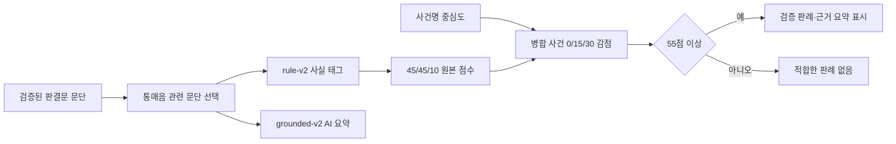

# 통매음 검색 품질 개선 설계

## 목표

사용자 사례와 사실관계가 직접 닮은 통신매체이용음란 판례를 우선하고, 다른 범죄가 함께 다루어진 병합 사건이 검색어를 우연히 많이 포함한다는 이유로 상위에 노출되는 문제를 줄인다. 적합한 판례가 없으면 결과를 만들거나 억지로 표시하지 않는다.

## 범위

- 자연어 사례 24개로 고정 평가 세트를 만든다.
- 판례의 통매음 중심도를 `focused`, `mixed`, `peripheral`로 분류한다.
- `mixed`는 최종 검색 점수에서 15점, `peripheral`은 30점을 감점한다.
- 검색 점수가 55점 미만인 판례는 표시하지 않는다.
- 사실 태그와 AI 요약은 통매음 관련 문단을 우선하도록 입력 범위를 제한한다.
- 기존 검증 게이트, 공식 원문 링크, 원문 해시, AI 표시 규칙은 변경하지 않는다.

## 제외 범위

- 유·무죄, 고소 가능성, 형량을 예측하지 않는다.
- 사용자 사례를 AI 요약 모델에 보내지 않는다.
- 통매음 외 법률 분야 확장은 이번 작업에 포함하지 않는다.
- 신규 외부 판례 소스를 추가하지 않는다.

## 현재 문제

1. 판결문 전체를 사실 태그 추출에 사용하므로 병합된 다른 범죄의 매체·관계·표현 태그가 섞인다.
2. 키워드 점수를 현재 후보군의 최댓값으로 정규화하여 절대적으로 약한 일치도 100점이 될 수 있다.
3. 임베딩을 사용하지 않는 경로는 55점 최저선을 적용하지 않는다.
4. 전체 판결문 요약은 병합 사건의 다른 범죄 내용을 주요 내용으로 표시할 수 있다.

## 설계

### 1. 품질 평가 세트

`tests/fixtures/search-quality-cases.mjs`에 게임 채팅, 카카오톡, SNS 멘션, 송금메모, 이미지 전송, 단발·반복, 다툼·일방적 전달, 부족한 입력을 고루 포함한 24개 사례를 저장한다.

각 사례는 다음 검증값을 가진다.

- `query`: 자연어 사례
- `expectedTopCaseNumbers`: 상위 3개 안에 포함되어야 하는 검증 판례 사건번호
- `forbiddenTopCaseNumbers`: 상위 3개에 나오면 안 되는 주변적 병합 사건
- `expectEmpty`: 판례를 표시하지 않아야 하는 입력

평가 스크립트는 실제 로컬 DB를 읽고 다음 지표를 JSON으로 출력한다.

- Top-1 정확도
- Top-3 포함률
- 금지 병합 사건 노출률
- 빈 결과 정확도

### 2. 통매음 중심도

판례 사건명을 결정적 근거로 사용하는 순수 함수 `classifyPrecedentFocus(caseName)`를 추가한다.

- `focused`: 사건명의 범죄명이 통신매체이용음란 하나이거나, 대법원 주요 사건 설명이 붙은 단일 쟁점 판례
- `mixed`: 통신매체이용음란과 다른 범죄가 `·`, `,`, `(병합)` 등으로 함께 표시된 판례
- `peripheral`: 사건명에 통신매체이용음란과 함께 `13세미만미성년자강간`, `강간`, `미성년자의제간음`, `간음유인`, `부착명령` 중 하나 이상이 함께 표시된 판례. `peripheral` 규칙을 `mixed`보다 먼저 적용한다.

감점은 `focused=0`, `mixed=15`, `peripheral=30`으로 고정한다. 원본 점수를 0~100 범위로 계산한 뒤 감점하고, UI에는 감점이 반영된 최종 `사실관계 유사도`만 표시한다.

### 3. 점수와 최저선

기존 구성은 유지한다.

- 키워드 또는 의미 일치: 45%
- 사실 태그: 45%
- 쟁점 태그: 10%

키워드 점수는 후보군 내 최댓값 대비가 아니라 PostgreSQL `ts_rank_cd`를 고정 상한 `0.5`로 나누어 0~100으로 정규화한다. `ts_rank_cd >= 0.5`는 키워드 100점으로 상한 처리하고, `0.1`은 20점으로 계산한다. 임베딩·비임베딩 경로 모두 최종 점수 55점 미만을 제거한다.

### 4. 관련 문단 선택

`selectCommunicationObscenityParagraphs(paragraphs)`는 원문 문단 ID를 그대로 유지하면서 다음 신호가 있는 문단을 우선 선택한다.

- `통신매체이용음란`, `성폭력처벌법 제13조`
- `통신매체`, `성적 욕망`, `성적 수치심`, `성적 혐오감`
- 해당 표현이 있는 문단의 앞뒤 각 1개 문단

선택 결과가 3개 미만이면 전체 문단을 대신 사용하지 않고 요약을 생성하지 않는다. 요약 모델은 선택된 문단만 받는다. 사실 태그는 선택된 문단이 있으면 그 범위를 사용하고, 없으면 보수적인 `unknown`값을 저장한다.

파일럿에서 비관련 민사사건과 병합사건의 다른 범죄 내용이 요약되는 사례가 확인되었다. 따라서 `grounded-v2` AI 요약은 사건명에 통신매체이용음란이 포함된 `focused` 판례에만 허용한다. `mixed`와 `peripheral` 판례는 검색 결과에 남기되 AI 요약은 생성·노출하지 않는다.

### 5. 캐시 무효화

문단 선택 로직이 변경되므로 사실 태그 버전을 `rule-v2`, 요약 버전을 `grounded-v2`로 증가시킨다. 새 버전이 없는 판례는 검색에서 요약을 `null`로 반환하여 예전 요약이 노출되지 않게 한다.

## 데이터 흐름

## 오류·안전 처리

- 문단 선택 실패는 전체 판례로 폭넓게 폴백하지 않는다.
- 사실 태그가 없는 판례는 키워드·임베딩 일치도만 사용하며, 55점 기준을 그대로 적용한다.
- 요약 재생성 실패는 판례 검색을 중단하지 않고 `summary:null`로 표시한다.
- 검증되지 않은 판례 신원 정보는 계속 폐기한다.
- 평가 실패는 배포 자체를 자동으로 중단하지는 않지만, 전후 지표와 실패 사례를 보고한다.

## 테스트와 성공 기준

### 단위 테스트

- 중심도 분류가 단일 사건과 병합 사건을 구분한다.
- 감점 후 점수는 0~100이며 55점 미만이 제거된다.
- 단순 키워드 일치가 후보군 크기에 따라 100점으로 변하지 않는다.
- 관련 문단 선택이 원래 문단 ID와 인접 문단을 유지한다.
- 요약의 모든 근거 ID가 선택된 문단 안에 있다.

### 통합 평가

변경 후 지표는 변경 전보다 아래 조건을 모두 만족해야 한다.

- Top-1 정확도가 하락하지 않는다.
- Top-3 포함률이 하락하지 않는다.
- 금지 병합 사건 노출률이 감소한다.
- `expectEmpty` 사례에서 결과를 생성하지 않는다.
- 전체 자동 테스트와 Sites 빌드가 통과한다.

## 후속 작업

이 설계가 완료되면 다음 단계는 국가법령정보센터 정기 동기화 파이프라인이다. 신규·변경 판례를 수집한 뒤 검증, 관련 문단 선택, 태그, 임베딩, 요약을 순서대로 재생성한다.
